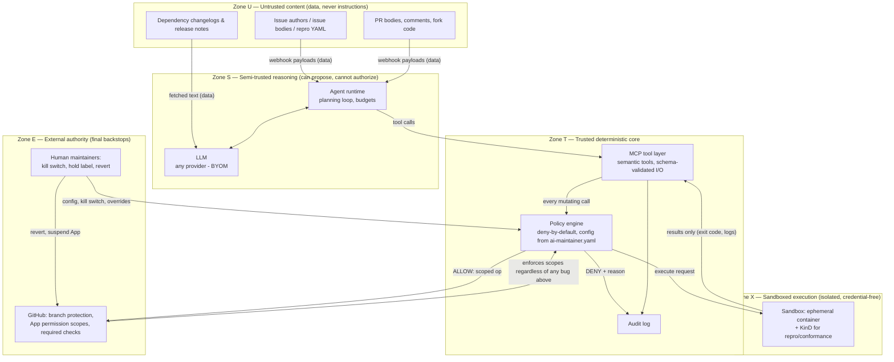

# TRUST_MODEL.md — Phase 4

Core principle (thesis): **the LLM proposes; deterministic systems authorize; sandboxes execute.** Trust decreases from bottom-left (maintainers, policy code) to top-right (issue authors, dependency changelogs). Nothing in a higher-distrust zone can direct anything in a lower one — content only crosses boundaries as *data* that deterministic code parses.

## Trust-boundary diagram

Boundary-crossing rules:
1. **U→S:** untrusted text enters the LLM context only wrapped/labeled as quoted data; nothing in it is executed or obeyed. (Runtime restatement of this repo's own standing rule.)
2. **S→T:** the agent can only *request* tools; every mutating request produces a policy Decision bound to fresh state + head SHA (RISKS G2/P4).
3. **T→X:** only allowlisted, parameterized commands enter the sandbox; no credentials cross this boundary (RISKS S3).
4. **X→T:** only structured results (exit codes, parsed reports, bounded logs) come back; sandbox output is itself untrusted text when shown to the LLM (test output can contain injection too).
5. **T→E:** GitHub App scopes + branch protection enforce limits even if every layer above is buggy — defense in depth, not a single perimeter.

## Actor table

| Actor | Controls | Can influence | Cannot touch |
|---|---|---|---|
| **LLM (any provider)** | Its own text/tool-call proposals | Which tools are *requested*; content of comments/summaries/classifications (within templates & allowlists) | Policy decisions; credentials; raw shell; anything mutating without an ALLOW; its own budget limits |
| **Agent runtime** | Planning loop, retries, run lifecycle, budget enforcement | Order/selection of tool calls; when a run aborts | Policy rules; GitHub credentials directly (held by MCP/executor layer); sandbox internals |
| **MCP tool layer** | Tool schemas, input validation, marshalling to GitHub/sandbox | What capabilities exist at all (a tool not exposed cannot be requested) | Authorization outcomes (must defer to policy engine); protected refs (structurally no API for them) |
| **Policy engine** | ALLOW/DENY for every mutating action and every sandbox command; rate limits; kill-switch state | Nothing proactively — it only answers | Cannot initiate actions; cannot be overridden by LLM output; config changes require human commit |
| **Sandbox** | Execution environment for tests/repro (ephemeral FS, KinD) | Test/repro results (which feed later reasoning as data) | GitHub credentials; host filesystem; network beyond allowlist; anything outside its cgroup limits |
| **GitHub (platform)** | Branch protection, App permission scopes, required checks, webhook delivery | Event timing/duplication (G3); API availability | N/A — it is the external enforcement backstop; the design assumes it enforces scopes correctly |
| **Repo contributors (PR authors)** | Their own PR content — body, commits, fork code | Agent's *analysis* of their PR; which suites W3 selects; labels applied to their PR | Merge decisions; policy config; sandbox credentials (fork code runs credential-free, G6) |
| **Issue authors** | Issue text and attached YAML (max-distrust input) | Triage classification proposal; whether a scripted repro is attempted; content-shape of one templated comment (A2 residual) | Any label outside allowlist; close/assign; repro script contents; anything outside the sandbox |
| **External users (Slack/Discussions)** | — (dropped from POC scope, W6) | Roadmap only | Everything |
| **Human maintainers** | Policy config (`ai-maintainer.yaml`), kill switch, hold labels, App installation (suspend = break-glass), reverts | Everything, by design | — (ultimate authority; the one actor with no "cannot") |

## Key asymmetries worth stating in the demo

- **The LLM is in the same trust zone as nothing.** It is *less* trusted than the sandbox (the sandbox at least has deterministic limits) and *more* trusted than raw issue text only in that its output is allowed to become proposals.
- **Compromise analysis:** a fully adversarial LLM (worst case: model provider compromised) can, at most, emit misleading advisory text and burn its rate-limited action budget on allowlisted, revertible actions — it cannot merge a major bump, touch a protected ref, or reach credentials. That claim is exactly what Phase 14 must demonstrate.
- **Two independent enforcement layers** (policy engine in-process, GitHub scopes/branch protection out-of-process) mean a single bug is a contained failure, not a compromise (RISKS G4).
