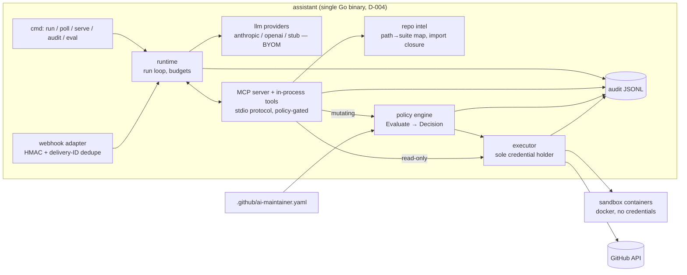
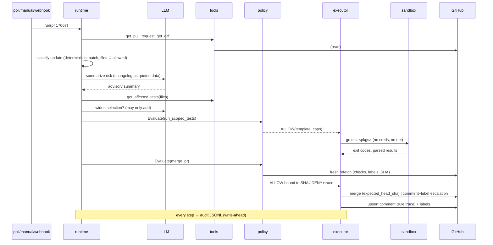

# ARCHITECTURE.md — Phase 15: Review Pack

Consolidates: TRUST_MODEL.md (trust boundaries), MCP_TOOLS.md (capability surface), POLICY_ENGINE.md (authorization), SANDBOX.md (execution), AUDIT.md (records), OVERRIDE.md (control), POC_SCOPE.md (scope), EVAL_HARNESS.md + INJECTION_TESTS.md (verification plan). This file adds the component/data-flow/sequence views, the permission model, and the self-critique.

## Component diagram

## Data flow (primary flow)

GitHub PR facts + diff → deterministic classifier → context; changelog/diff text (untrusted) → LLM → advisory summary; changed files → intel → selection; selection → policy(`run_scoped_tests`) → sandbox → structured results; all facts → policy(`merge_pr`) fresh-fetch → ALLOW+SHA → executor merge → audit + comment. Untrusted text never enters: classifier, intel, policy inputs. (Trust zones: TRUST_MODEL.md.)

## Sequence — dependency flow (primary)

Sequence for triage-lite is the degenerate case: get_issue → classify (LLM) → Evaluate(set_labels/comment) → execute → audit. No sandbox.

## Permission model (three independent layers)

| Layer | Grants | Denies |
|---|---|---|
| GitHub App installation (fork) | metadata:read, contents:read+write (merge needs it), issues:write, pull_requests:write, checks:read | admin, workflows:write, secrets; **branch protection still applies on top** |
| Policy engine (per action) | ALLOW per POLICY_ENGINE rule order, SHA-bound, TTL'd | deny-by-default; protected paths; rate limits; kill switch |
| Structural (code) | 12 tools exist; 3 mutate; executor holds the only token; sandbox holds none | no push/close/approve/shell tool exists at all |

Honest note: `contents:write` (required by merge) is the App's broadest grant — mitigated by branch protection on `main`/`release-*` (unverified upstream, ASSUMPTIONS #1; **on the demo fork we configure it ourselves and show it**) and by the policy layer. This is the permission a reviewer should probe hardest; say so in the video.

## Failure-mode summary
Top residuals (RISKS.md): G1 compromised-green patch bump (bounded: allowlisted paths, rate limit, 1-command revert; stricter than the human status quo), A2 advisory-text poisoning (contained, demonstrated by I5), S1 privileged-DinD escape (credential-free sandbox, VM roadmap), T1 selection recall <100% (advisory-only until measured). Eval plan: EVAL_HARNESS.md (110 real historical cases collected); injection plan: INJECTION_TESTS.md (10 vectors).

## Final POC scope
Per POC_SCOPE.md: primary dependency flow (all 7 pillars), triage-lite secondary, W5 built, webhook adapter shipped on the same run entrypoint (D-004). OPA/VM remain roadmap. Implementation order (Phase 16): policy engine+tests → audit → intel/selector → GitHub layer → runtime+LLM → sandbox → E2E dry-run → injection pass → live demo runs.

## Self-critique

**What would a Kyverno maintainer object to?**
1. *"Auto-merge is exactly where I'd be burned by a supply-chain attack"* — answer: the gate is strictly narrower than current human batch-merging (path allowlist, patch/minor, groups, rate limit, optional min-age); every merge is one revert away; start in `approval` mode. The objection is legitimate — which is why modes exist and default conservative.
2. *"Another bot commenting on issues"* — answer: upsert-only, 2/day/entity cap, never re-applies human-removed labels. Volume math: ~1 comment per processed entity.
3. *"Who maintains the path→suite map?"* — weakest point, honestly: the map rots. Mitigations: `unmapped → full suite` fail-safe, fallback-rate metric surfaces rot, map generated partly from `labels.yml` globs already maintained by the project. Still a real ongoing cost — stated in roadmap.
4. *"Why not just GitHub's native Dependabot auto-merge?"* — real question. Native auto-merge can't express: path-allowlist verification, group/security-list policies, scoped-test evidence, audit rationale, staged approval modes. The POC's answer must be shown, not asserted — the DENY demo (workflow-pin bump flagged) is native-automerge-can't-do-this on camera.

**What would a security engineer object to?**
1. Privileged DinD (S1) — acknowledged; unprivileged for unit runs; VM-per-run named as the production fix; zero credentials inside either way.
2. `contents:write` breadth — see permission model note; branch protection demonstrated on the fork.
3. Audit log is local and mutable — hash chain is nice-to-have only in POC; production wants shipped, append-only storage. Conceded in roadmap.
4. LLM sees secrets? No — provider receives repo-public text only; BYOM/local-model support is the answer for orgs that won't ship even that.

**What would an agent-infra engineer object to?**
1. *"Your MCP layer is in-process Go interfaces, not an actual MCP server"* — addressed: `assistant mcp` serves the tool surface over the official MCP protocol (stdio, `github.com/modelcontextprotocol/go-sdk`). Mutating tools still call `policy.Engine.Evaluate` then the same `ghx` methods the CLI uses; the server is a new transport, not a new authority.
2. *"Polling, not webhooks"* — both adapters now exist. `assistant serve` is HMAC-SHA256 verified, delivery-ID deduped (in-memory for the POC; persistent store is a production follow-up), and calls the same `RunDependencyPR` / `RunIssueTriage` entrypoint as `run --pr` / `run --issue`. No new privilege, no policy bypass.
3. *"Stub LLM in tests"* — determinism for CI; real-model runs are the eval/demo path, both recorded.

**Over-engineered for a POC?** Hash-chained audit (dropped to nice-to-have), OPA (rejected), multi-agent (rejected), W5 repro harness (deferred with design done). **Genuinely necessary:** policy golden tests, SHA-bound decisions, credential-free sandbox, audit write-ahead — these are the thesis. **Demo-only:** rendered rule trace in comments (doubles as UX), `docker stats` on camera, staged Dependabot-shaped PR if no live one is open.
